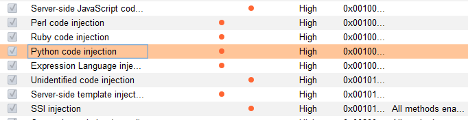
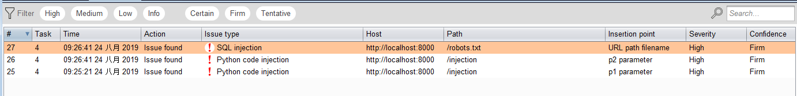
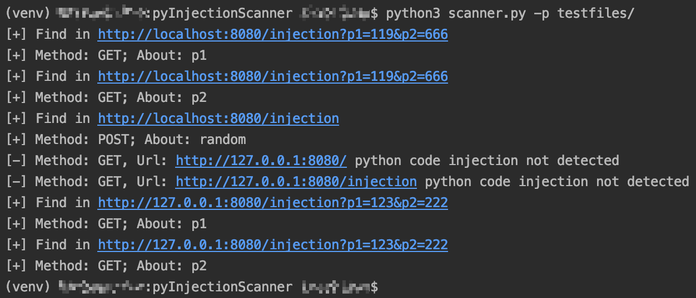

# pyInjectionScanner

原项目：https://github.com/sethsec/PyCodeInjection

在最近的渗透测试中发现对某些方面的检测已经越来越疲软，速度太慢了，原项目的操作速度已经无法满足撒网捕鱼的需求，然后有了弄成自动化扫描的想法。

python 远程代码注入扫描，可以根据输入的 url 或 request 文件自动化检测 query、post body、cookie 三个请求头的数据，我对它的设想是，使用一个高效且准确的爬虫引擎（比如 awvs）将 url 爬下来，使用脚本自动化对相关数据进行检测。目前对其能力还不是很满意，还存在一些不足点。

+ VulnApp 文件夹中的 main.py 为测试 web 应用程序
+ injection.py 为攻击脚本
+ scanner.py 为批量 url 扫描脚本

之前和大佬交流了一下扫描思路，发现很尴尬的事情。但是没关系，就当练手了，而且我猜测 burpsuite 无法对动态网站或 api 进行检测，这时候脚本就有作用啦。





scanner.py 脚本运行效果



# 快速开始

### 依赖

+ Python >= 3.6

进入项目目录，使用以下命令安装依赖库

```
$ pip3 install -r requirements.txt
```

若需测试 web 应用程序，在 *VulnApp* 目录下再执行一次以上相同的操作

### 使用说明

**injection.py 帮助内容**

```
usage: injection.py [-h] [-u URL] [-c CMD] [-p [PARAMS [PARAMS ...]]]
              [-r REQUEST_FILE]

optional arguments:
  -h, --help            显示帮助信息
  -u URL, --url URL     URL；在 url 中使用 "*" 或设置 `-p` 参数指定注入点
  -c CMD, --cmd CMD     远程执行的命令
  -p [PARAMS [PARAMS ...]], --params [PARAMS [PARAMS ...]]
                        指定注入的参数
  -r REQUEST_FILE, --request-file REQUEST_FILE
                        指定请求文件；`*` 和 `-p` 参数均有效
  -m METHOD, --method METHOD
                        HTTP 请求方法（默认：GET）
  -b BODY, --body BODY  POST 数据
  -i, --interactive     交互模式
```

**scanner.py 帮助内容**

```
usage: scanner.py [-h] [-p PATHS [PATHS ...]]

optional arguments:
  -h, --help            显示帮助信息
  -p PATHS [PATHS ...], --paths PATHS [PATHS ...]
                        文件或文件夹路径
```

# 其它

### 缺陷

+ 读取文件的 url 的情况下只能使用 GET 方法发起请求
+ 读取文件的 url 的情况下未对 Cookie 进行检测
+ 请求附带数据的情况下只能对表单数据（application/x-www-form-urlencoded）进行检测
+ 脆弱点未详细标记
